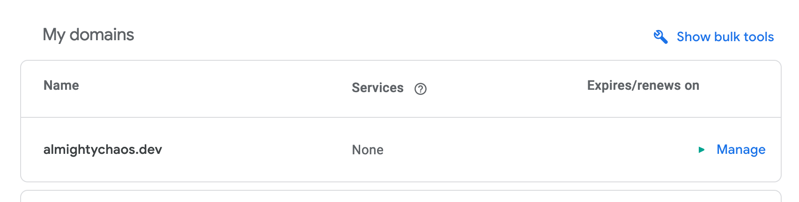

# Setting up Google Domain with GitHub Pages 


## Intro

Github pages is easy to setup, but to attach a custom domain with google domains, you may run into problems. Here is how you can do it in 4 steps.


## Prerequisites

- Github Pages Repository <br>
({yourname}/{yourname}.github.io) <br>
e.g. `allmightychaos/allmightychaos.github.io`
- You purchased a custom Domain on Google <br>
e.g. `almightychaos.dev`

---

## Step 1: Add your custom Domain to GitHub
- Open your Repository Settings on GitHub.


- Go to "Pages" under "**Code and automation**"


- Add your custom Domain to the "Custom Domain" field.


- Save your changes.

## Step 2: Point your custom Domain to GitHub
- Open your [Google Domains Dashboard](https://domains.google.com/registrar/).

- Click on the "**Manage**" button of your custom Domain.



- Click on the "**DNS**" tab.


- Create a new "**A**" record with the following values:
  - **Name**: either leave it empty or `@`
  - **TTL**: `1 hour` (`3600`)
  - **IP addresses**: <br>
    - 185.199.111.153 <br>
    - 185.199.110.153 <br>
    - 185.199.109.153 <br>
    - 185.199.108.153 <br>
- Then save your changes. (We will come to the CNAME later!)


- To confirm that your DNS record is set up accordingly, use the `dig`-command.

```bash
dig almightychaos.dev +noall +answer

; <<>> DiG 9.10.6 <<>> almightychaos.dev +noall +answer
;; global options: +cmd
almightychaos.dev.	4502	IN	A	185.199.111.153
almightychaos.dev.	4502	IN	A	185.199.110.153
almightychaos.dev.	4502	IN	A	185.199.108.153
almightychaos.dev.	4502	IN	A	185.199.109.153
```

## Step 3: Add a CNAME record to your DNS
- Return to your Custom records.
- Create a new "**CNAME**" record with the following values:
  - **Name**: `www`
  - **TTL**: `1 hour` (`3600`)
  - **Target**: `{yourname}.github.io`
- Then save your changes.

# Step 4: (optional, but highly recommended) 
- Go back to your GitHub **Repository -> Settings -> Pages**
- If the DNS check has been completed, click on the checkmark that says "**Enforce HTTPS**".


## Step 5:
- Visit your custom Domain and enjoy your new website!
